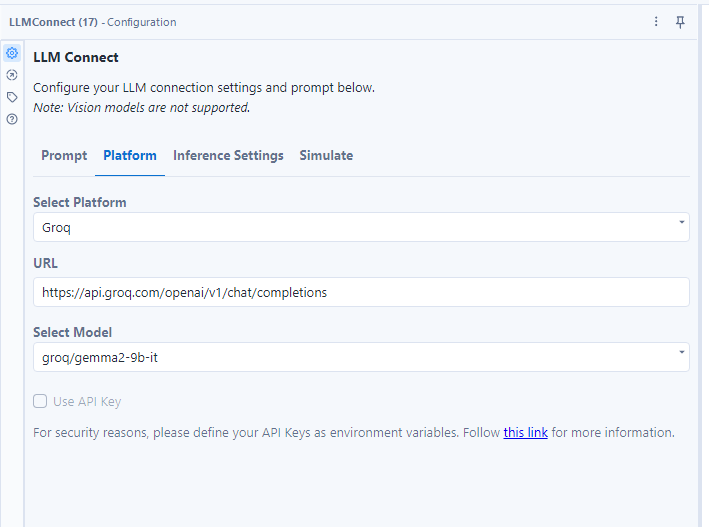
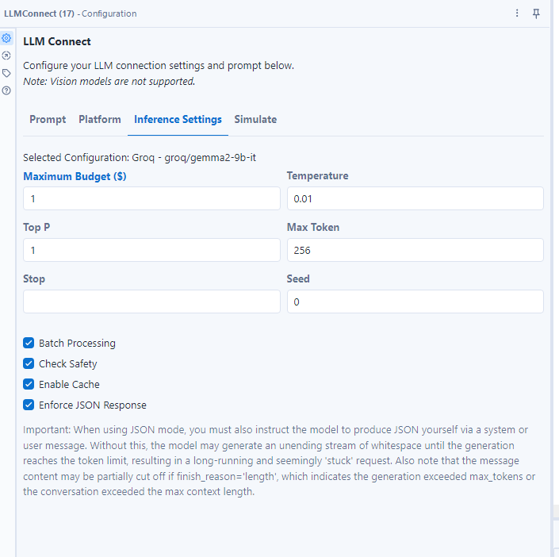
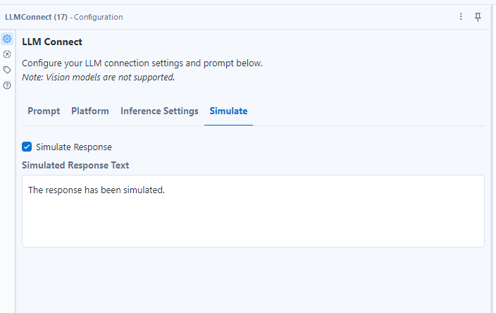
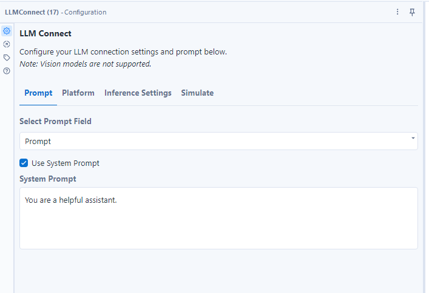

# ConnectLLM for Alteryx

ConnectLLM is a powerful and flexible custom Tool for Alteryx that enables seamless integration with over 1000 Large Language Models (LLMs) across more than 20 platforms for batch completions. This tool simplifies the process of interacting with a vast array of language models, making it easy for Alteryx users to incorporate advanced natural language processing capabilities into their workflows, regardless of their preferred AI provider or model.

## Features

- Support for 1000+ LLM models across 20+ platforms
- Local inference capabilities with CPU and GPU support
- GPU offloading for resource-intensive tasks
- Integration with major AI providers including OpenAI, Microsoft Azure, Google (Gemini and Vertex AI), Mistral AI, AWS Bedrock, IBM, and more
- Batch processing for efficient and fast completions
- Customizable inference parameters
- Simulation mode for testing and development
- Easy integration with Alteryx workflows
- Parameter saving for consistent reuse
- Caching mechanism to avoid redundant and costly API calls
- Enforce JSON output format
- Budget manager to control costs
- Multi-language support (English, Spanish, French, German, Polish, Portuguese, Chinese, Japanese, Russian)

## Installation

To install ConnectLLM for Alteryx:

1. Download the ConnectLLM.yxi file from the releases page
2. Double-click the .yxi file to install it in Alteryx Designer
3. Restart Alteryx Designer to complete the installation
4. Set up your API keys as environment variables
5. (Optional) For local inference: Install CUDA drivers if using GPU acceleration

## Usage

1. Drag the ConnectLLM tool from the tool palette onto your Alteryx workflow
2. Connect your input data stream to the tool
3. Configure the tool settings:
   - Select between cloud providers or local inference mode
   - For local inference, choose CPU or GPU execution:
   
     
   
   - Configure GPU offloading settings for resource-intensive tasks
   - Select the LLM provider and model from the extensive list of 1000+ supported options across 20+ platforms:
   
     
   
   - Set inference parameters (temperature, max tokens, etc.):
   
     
   
   - Set the maximum budget for API calls
   - Select Batch inference to process multiple records in a single API call
   - Configure caching options to optimize API usage
   - Check "Enforce JSON output" to ensure the output is in JSON format
   - Add safety settings to prevent harmful outputs
4. Choose between live API calls or simulation mode:
   
   
   

5. Define your prompt and system prompt:

   

6. Run your workflow to generate batch completions

## Configuration

ConnectLLM allows you to customize various settings:

- Execution Mode: Choose between cloud providers or local inference
- Hardware Acceleration: Select CPU or GPU for local inference
- GPU Offloading: Configure automatic offloading settings when local resources are insufficient
- LLM Provider: Choose from 1000+ supported models across 20+ platforms, including OpenAI, Microsoft Azure, Google (Gemini and Vertex AI), Mistral AI, AWS Bedrock, IBM, and more
- Model Selection: Pick the specific model for your task from a wide range of options
- Inference Parameters: Adjust settings like temperature, max tokens, and top_p
- Batch inference: Process multiple records in a single API call
- API Configuration: Set API keys and endpoints for your chosen provider as environment variables
- Simulation Mode: Enable/disable mocking for testing purposes
- Caching: Configure caching settings to reduce API calls and costs
- Language: Select the input and output language for your completions

## Language Support

ConnectLLM supports multiple languages for input and output:

- English (en)
- Spanish (es)
- French (fr)
- German (de)
- Polish (pl)
- Portuguese (pt)
- Chinese (cn)
- Japanese (ja)
- Russian (ru)

You can select the desired language in the tool configuration to ensure your completions are generated in the appropriate language.

## Saving Parameters

You can save your configuration settings for easy reuse:

1. Set up your desired parameters in the tool configuration
2. Click the "Save Parameters" button
3. Give your configuration a name
4. Load saved parameters in future workflows using the "Load Parameters" option

## Contributing

We welcome contributions to ConnectLLM for Alteryx! Please see our [Contributing Guide](CONTRIBUTING.md) for more information on how to get started.

## License

ConnectLLM for Alteryx is released under the MIT License. See the [LICENSE](LICENSE) file for details.

## Support

If you encounter any issues or have questions, please file an issue on our [GitHub repository](https://github.com/jupiterbak/ConnectLLM-Alteryx/issues) or contact Alteryx support.

## System Requirements for Local Inference

For local inference capabilities:

- Minimum 16GB RAM for CPU inference
- NVIDIA GPU with 6GB+ VRAM for GPU acceleration
- CUDA 11.7 or higher for GPU support
- Windows 10/11 or Linux operating system
