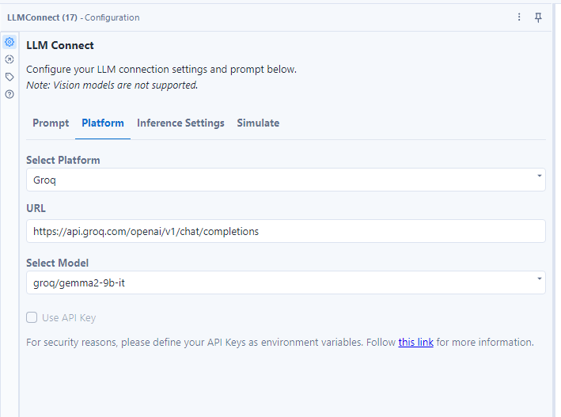
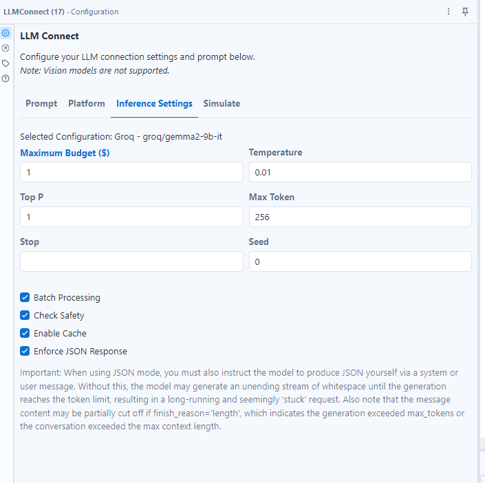
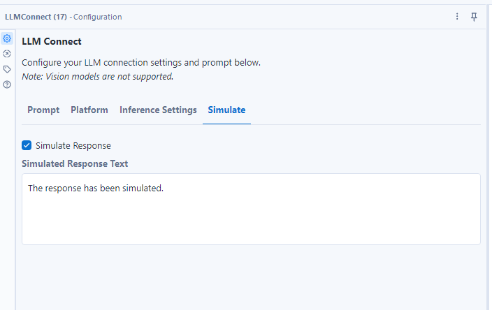
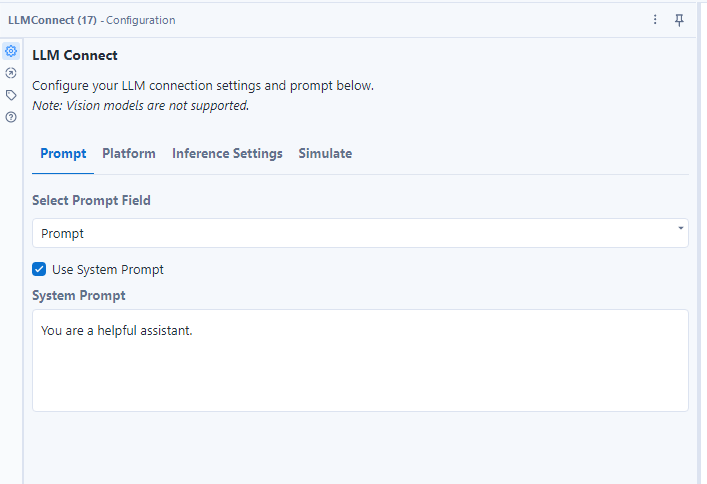

# ConnectLLM for Alteryx

ConnectLLM is a powerful and flexible custom Tool for Alteryx that enables seamless integration with over 1000 Large Language Models (LLMs) across more than 20 platforms for batch completions. This tool simplifies the process of interacting with a vast array of language models, making it easy for Alteryx users to incorporate advanced natural language processing capabilities into their workflows, regardless of their preferred AI provider or model.

## Features

- Support for 1000+ LLM models across 20+ platforms
- Three inference types: **Remote** (cloud API), **Localhost** (local inference server), and **CPU/GPU** (direct GGUF model file inference)
- Local GGUF model inference via llama-cpp-python with CPU and GPU support
- GPU offloading for resource-intensive tasks with configurable layer splitting
- Integration with major AI providers including OpenAI, Microsoft Azure, Google (Gemini and Vertex AI), Mistral AI, AWS Bedrock, IBM, HuggingFace, and more
- Localhost server support for Ollama, LM Studio, and any OpenAI-compatible local inference server
- Batch processing for efficient and fast completions
- Customizable inference parameters
- Simulation mode for testing and development
- Easy integration with Alteryx workflows
- Parameter saving for consistent reuse
- Caching mechanism to avoid redundant and costly API calls
- Enforce JSON output format
- Budget manager to control costs
- Multi-language support (English, Spanish, French, German, Polish, Portuguese, Chinese, Japanese, Russian)

## Installation

To install ConnectLLM for Alteryx:

1. Download the ConnectLLM.yxi file from the releases page
2. Double-click the .yxi file to install it in Alteryx Designer
3. Restart Alteryx Designer to complete the installation
4. Set up your API keys as environment variables
5. (Optional) For GPU-accelerated local inference: Install CUDA drivers

## Inference Types

ConnectLLM supports three distinct inference modes, selectable from the **Platform** tab:

### Remote

Sends requests to a cloud-based LLM provider via API. Choose from 20+ supported platforms including:

- OpenAI
- Microsoft Azure
- Google (Gemini and Vertex AI)
- Mistral AI
- AWS Bedrock
- IBM
- HuggingFace (Inference Providers — Llama, DeepSeek, Mistral, Falcon, and more)
- Anyscale
- And many more

API keys are read from environment variables for security. See your platform's documentation for the required variable names.

### Localhost

Connects to a locally running OpenAI-compatible inference server such as **Ollama** or **LM Studio**. Configure the server URL (default: `http://localhost:11434/v1/chat/completions`) and enter the model name served by your local server. No API key is required.

Use this mode when you want to run models locally but prefer a server-based setup rather than loading model weights directly in Alteryx.

### CPU / GPU (Direct GGUF Inference)

Loads a GGUF model file directly inside the Alteryx process using **llama-cpp-python**. This mode is fully self-contained — no external server or API key is needed.

- Browse for a folder containing `.gguf` model files
- The tool automatically identifies the main model file and any multimodal projector (`mmproj`) file for vision-capable models
- Enable **GPU Offload** to accelerate inference on NVIDIA GPUs (CUDA required)
- Configure the number of GPU layers to split computation across GPU and CPU
- Set the **Input Context Length** to control the model's context window
- The tool reports available GPU resources at startup via `nvidia-smi`
- Cost is always $0 for local inference

## Usage

1. Drag the ConnectLLM tool from the tool palette onto your Alteryx workflow
2. Connect your input data stream to the tool
3. Configure the tool settings:

   **Platform tab** — Select the inference type:

   - *Remote*: select a cloud platform, model, and set API keys as environment variables

     

   - *Localhost*: enter the server URL and model name for Ollama or LM Studio

   - *CPU/GPU*: browse for a GGUF model folder and configure GPU offload settings

     

   **Inference Settings tab** — Tune generation parameters:

   

   - Temperature, Top P, Max Tokens, Stop sequences, Seed
   - Maximum budget cap for API calls
   - Batch inference to process multiple records in a single API call
   - Caching to avoid duplicate API calls
   - Enforce JSON output format

4. Choose between live API calls or simulation mode:

   

5. Define your prompt and system prompt:

   

6. Run your workflow to generate completions

## Configuration

| Setting | Description |
| --- | --- |
| Inference Type | `Remote`, `Localhost`, or `CPU` (GGUF) |
| Platform | Cloud provider for Remote mode |
| Server URL | Endpoint for Localhost mode (e.g. Ollama, LM Studio) |
| Model / Model Path | Model name or path to a GGUF folder |
| GPU Offload | Enable NVIDIA GPU acceleration for GGUF inference |
| GPU Layers | Number of model layers to offload to GPU (-1 = all) |
| Input Context Length | Context window size for GGUF inference |
| Temperature | Sampling randomness (0–1) |
| Max Tokens | Maximum tokens to generate per response |
| Top P | Nucleus sampling threshold |
| Batch Processing | Send multiple prompts in one API call |
| Caching | Disk-based cache to skip repeated identical requests |
| Enforce JSON Response | Force the model to output valid JSON |
| Maximum Budget | Stop processing when cumulative API cost exceeds this value |
| Simulate Response | Return a fixed string instead of calling the model (for testing) |
| On Error | `Warning` (continue) or `Error` (halt) when a row fails |
| Response Column Name | Name of the output column added to the data stream |

## HuggingFace Support

Select **HuggingFace** as the platform under Remote inference to use the HuggingFace Inference Providers API. Supported model families include:

- Meta Llama (Llama-3.3-70B-Instruct and others)
- DeepSeek (DeepSeek-R1 via Together)
- Qwen (Qwen2.5-72B-Instruct via SambaNova)
- Mistral (Mistral-7B-Instruct)
- Falcon (tiiuae/falcon-7b-instruct)
- CodeLlama (CodeLlama-34b-Instruct)

Set the `HUGGINGFACE_API_KEY` environment variable with your HuggingFace token.

## Language Support

ConnectLLM supports multiple languages for input and output:

- English (en)
- Spanish (es)
- French (fr)
- German (de)
- Polish (pl)
- Portuguese (pt)
- Chinese (cn)
- Japanese (ja)
- Russian (ru)

## Saving Parameters

You can save your configuration settings for easy reuse:

1. Set up your desired parameters in the tool configuration
2. Click the **Save** (disk) icon in the top-right corner
3. A JSON file is downloaded with your current settings
4. Load saved parameters in future workflows using the **Import** icon

## System Requirements

| Requirement | Minimum |
| --- | --- |
| OS | Windows 10/11 or Linux |
| RAM (CPU inference) | 16 GB |
| NVIDIA GPU VRAM (GPU inference) | 6 GB+ |
| CUDA (GPU inference) | 11.7 or higher |
| Python | 3.10.13 |

## Contributing

We welcome contributions to ConnectLLM for Alteryx! Please see our [Contributing Guide](CONTRIBUTING.md) for more information on how to get started.

## License

ConnectLLM for Alteryx is released under the MIT License. See the [LICENSE](LICENSE) file for details.

## Support

If you encounter any issues or have questions, please file an issue on our [GitHub repository](https://github.com/jupiterbak/ConnectLLM-Alteryx/issues) or contact Alteryx support.
